# Blender Dragon's Dogma 2 import suite

This blender addon provides a suite of file importers for Dragon's Dogma 2 files.

## Prerequisites

Tested for blender 3.6+.

This addon is independant, and doesn't require external tools to work. Textures are imported using compiled code, whose shared libraries were tested for Windows and Ubuntu 22.04. Further platforms can be supported by compiling the code, following the steps further bellow.

Game files are normally stored in .pak files, which can be extracted by following the steps described in [this repository](https://github.com/Ekey/REE.PAK.Tool).

Some files, like materials, reference other files. To import them correctly, it is required to provide the path to the root of the game files to the addon. You will get an error message telling you to do that if you attempt it.

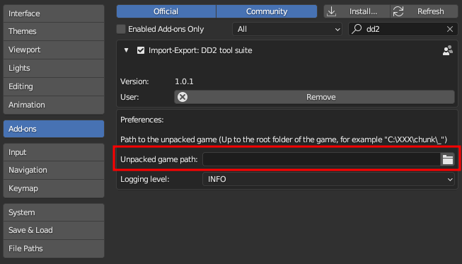

A lot of information is written in the console, such as if an object failed to be imported or was filtered away. If the console isn't opened by default, you can access it through the following menu:

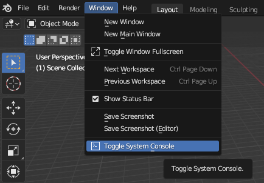

## Installation

Download the .zip file provided in one of the releases, and install it in blender's extension manager. 

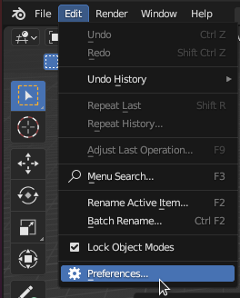

The importers can then be found here:

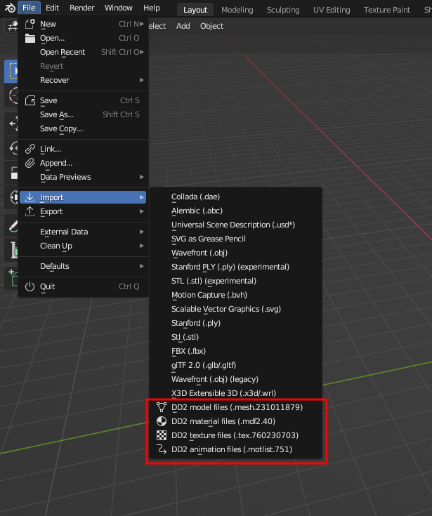

## Supported types

### Textures (tex.760230703 files)

Texture files are supported at import. Since blender is optimized to load more standard image formats, when a texture is loaded, a .png equivalent will automatically be created alongside it.

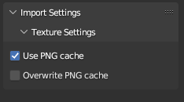

The next time that texture is loaded, the importer will use the .png file instead for a much faster loading time. This is enabled with the "Use PNG cache" setting shown at import.

You can overwrite the already generated .png images by checking the "Overwrite PNG" checkbox. 

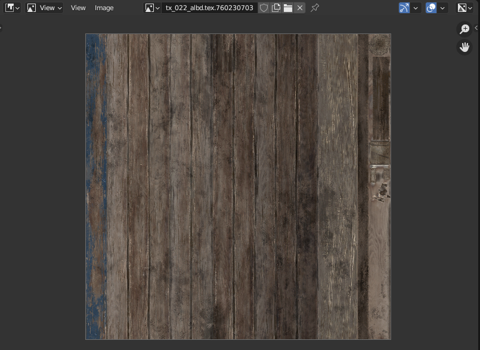

Note: some texture formats, most notably BC6 (used by skyboxes) are not supported for now. Which texture could be loaded or not is shown in the logs of the addon, in the python console.

### Materials (mdf2.40 files)

Material files are supported at import and export. Texture paths are included in the material data, so the importer will need to know where the game was extracted to load them properly. Make sure to fill that value in the addon's settings.

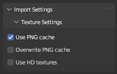

You have access to the same options as the texture import, along with an option to attempt using textures located in the "streaming" folder, which contains HD versions of the textures. Beware though, those textures are big and the initial loading will take time. Subsequent ones, using the .png cache, will be much faster.

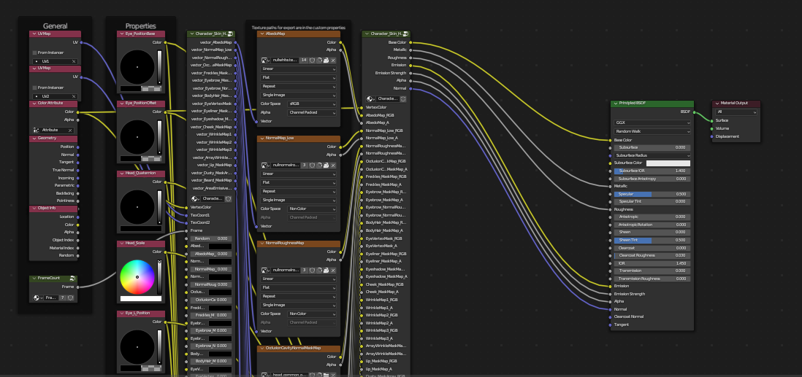

### Meshes (mesh.231011879 files)

Meshes files are supported at import and export. You can import a specific Level of Details (LoD) ; a lower number means the model will be more detailed. When importing a mesh, you'll have the option to also import the material file associated to it automatically. 

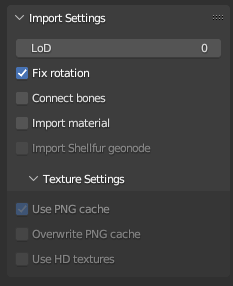

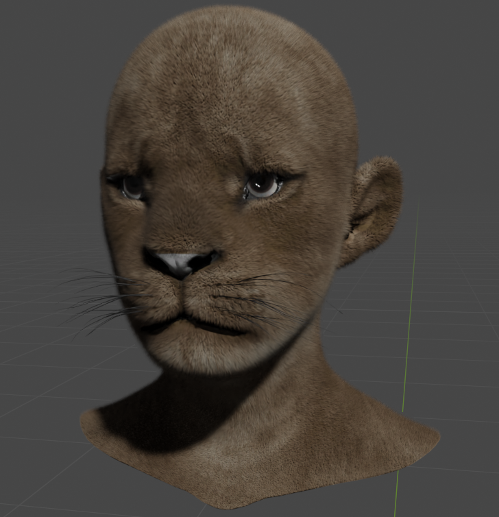

### Animations (mot.698 / motlist.751)

Animation files are supported at import. Due to a mismatch between the way blender and the game handle animations, a target armature is needed to apply the proper corrections when importing an animation. Make sure you have a single armature selected when doing so. 

LMT files are found in "mot" folders scattered around in the game files.

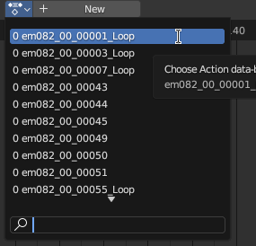

Animations will be loaded as actions. 

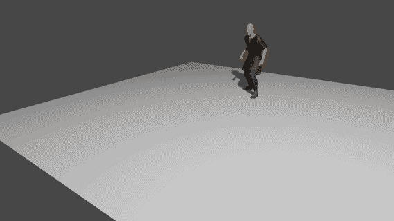

## Image importer compilation

The image reading code was written in C for speed reasons, and the source code of it is included in this addon.

If your platform isn't supported and you're reading this, you probably know better than me how to compile a shared library for it. In my case, the Ubuntu shared libraries were generated using the following argument in GCC: 

```
gcc read_dxgi_format.c -O3 -g -fopenmp -fPIC -c -o read_dxgi_format.o ; gcc read_dxgi_format.o -shared -fopenmp -o read_dxgi_format.so
```

## Credits

Most of the logic behind it is based on previous importers from MH Rise like [this](https://github.com/alphazolam/RE_RSZ) one and [this](https://github.com/alphazolam/fmt_RE_MESH-Noesis-Plugin) one, both created by the formidable [alphaZomega](https://github.com/alphazolam). Many many thanks to him.

Big thanks to [IvoryLagiacrus](https://twitter.com/ilagiacrus) for his general help and for being a great friend.
