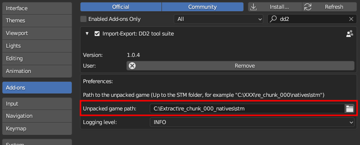

# Blender Dragon's Dogma 2 import/export suite

This blender addon provides a suite of file importers and exporter for Dragon's Dogma 2 files.

## Prerequisites

Tested for blender 3.6+.

This addon is independant, and doesn't require external tools to work. Textures are imported using compiled code, whose shared libraries were tested for Windows and Ubuntu 22.04. Further platforms can be supported by compiling the code, following the steps further bellow.

Game files are normally stored in .pak files, which can be extracted by following the steps described in [this repository](https://github.com/Ekey/REE.PAK.Tool).

Some files, like materials, reference other files. To import them correctly, it is required to provide the path to the root of the game files to the addon. You will get an error message telling you to do that if you attempt it.



A lot of information is written in the console, such as if an object failed to be imported or was filtered away. If the console isn't opened by default, you can access it through the following menu:


**NOTE: THE EXPORTERS ARE HIGHLY EXPERIMENTAL, AND ONLY WORKS FOR A SELECT FEW FEATURES. DON'T EXPECT TO DO HEAVY MODDING WORK WITH THEM UNTIL THEY GET MORE STABLE**

## Installation

Download the .zip file provided in one of the releases, or through the following menu:


The installation is done through Blender's addon manager.


The importers/exporters can then be found in blender's import/export menus:


## Batch import

The importing functions are callable through the python api.

For example, after installing the addon, running the following script will import objects all at once:

```python
import bpy
from glob import glob

files = glob("<extract_location>/Environment/Props/sm6X/sm61/**/*.mesh.231011879", recursive=True)

file_dict = [{"name":file} for file in files]

bpy.ops.dd2_import.dd2_mesh(files=file_dict, import_material=False)
```

This script behaves the same as selecting multiple files when importing through the GUI: you can set the import options through the arguments, and each imported object will be placed in its own collection.


## Supported types

### Textures (tex.760230703 files)

Texture files are supported at import and export. Since blender is optimized to load more standard image formats, when a texture is loaded, a .png equivalent will automatically be created alongside it.


The next time that texture is loaded, the importer will use the .png file instead for a much faster loading time. This is enabled with the "Use PNG cache" setting shown at import.

You can overwrite the already generated .png images by checking the "Overwrite PNG" checkbox. 


To export a texture, select a single image node in the shader tab, then export it through blender's export menu.


Note: some texture formats, most notably BC6 (used by skyboxes) are not supported for now. Which texture could be loaded or not is shown in the logs of the addon, in the system console.

Note: The export format is the simpliest available, and also probably the one that takes the most space. Expect files that are up to 4x as big as their original ones.

### Materials (mdf2.40 files)

**NOTE: IF YOU WISH TO EXPORT A MATERIAL, MAKE SURE TO DISABLE THE MATERIAL SIMPLIFICATION WHEN IMPORTING MESHES/MATERIALS**

Material files are supported at import and export. Texture paths are included in the material data, so the importer will need to know where the game was extracted to load them properly. Make sure to fill that value in the addon's settings.


You have access to the same options as the texture import, along with an option to attempt using textures located in the "streaming" folder, which contains HD versions of the textures. Beware though, those textures are big and the initial loading will take time. Subsequent ones, using the .png cache, will be much faster.


Some data will be put in the custom properties of the material, which will be used if the material is exported.


Exporting a material works the same way as exporting a mesh: select a few objects in the scene, then export the file through the export menu. The exporter will go over the objects, check their materials, and if compatible, will put their values in the resulting file. Make sure to check the system console for errors during the export.

### Meshes (mesh.231011879 files)

Meshes files are supported at import and export. You can import a specific Level of Details (LoD) ; a lower number means the model will be more detailed. When importing a mesh, you'll have the option to also import the material file associated to it automatically. 


When exporting a mesh file, select first all the models (and optionnaly a single armature) that you wish to export. The exporter will automatically filter objects that are incompatible, so make sure to check the logs in the python console for errors.


Note: The data in mesh files varies wildly, switching some meshes may just not work straight away. In addition, the mesh export function sometimes glitches and give false positive when rejecting a mesh for not being compliant with the export constraints: this will be fixed in the future.

### Animations (mot.698 / motlist.751)

Animation files are supported at import. Due to a mismatch between the way blender and the game handle animations, a target armature is needed to apply the proper corrections when importing an animation. Make sure you have a single armature selected when doing so. 


Animations will be loaded as actions. 


Note: Animations are currently broken for most characters, some work needs to be done to support everything.

## Image importer compilation

The image reading code was written in C for speed reasons, and the source code of it is included in this addon.

If your platform isn't supported and you're reading this, you probably know better than me how to compile a shared library for it. In my case, the Ubuntu shared libraries were generated using the following argument in GCC: 

```
gcc read_dxgi_format.c -O3 -g -fopenmp -fPIC -c -o read_dxgi_format.o ; gcc read_dxgi_format.o -shared -fopenmp -o read_dxgi_format.so
```

## Credits

Most of the logic behind it is based on previous importers from MH Rise like [this](https://github.com/alphazolam/RE_RSZ) one and [this](https://github.com/alphazolam/fmt_RE_MESH-Noesis-Plugin) one, both created by the formidable [alphaZomega](https://github.com/alphazolam). Many many thanks to him.

Big thanks to [IvoryLagiacrus](https://twitter.com/ilagiacrus) for his general help and for being a great friend.

The NRRT/NRRA Normal texture decoding was done by [PittRBM](https://bsky.app/profile/wdnrbm.bsky.social), kudos to him for figuring it out!
